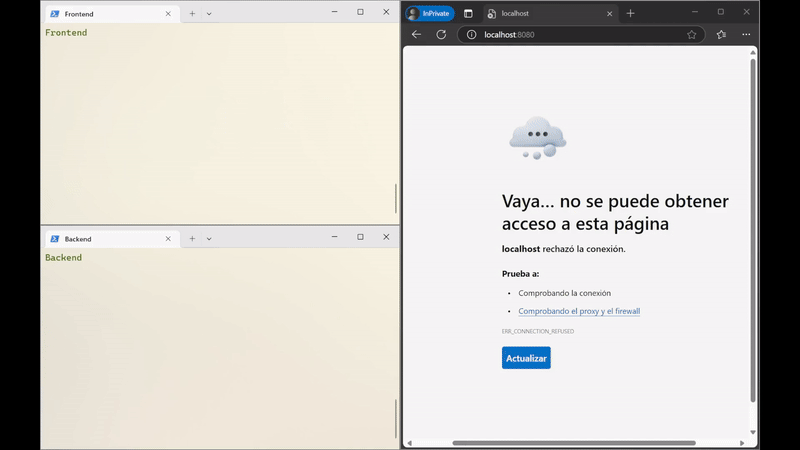

# Link shortener: frontend

This is the frontend part of the link shortener project with backend in the [link-shortener-backend](https://github.com/ckdvk/link_shortener-backend) repository. It is a simple Vue.js application that allows the user to shorten a link and copy the shortened link to the clipboard. The frontend communicates with the backend via REST API.

## Setup

1. Clone the repository
```bash
git clone https://github.com/ckdvk/link_shortener-frontend.git
```
2. Go to the project directory
```bash
cd link_shortener-frontend/link_shortener
```
3. Install dependencies
```bash
npm install
```
4. Run the application
```bash
npm run serve
```

## How it works

After starting the server, a Vue.js application will be available at the URL given by `VUE_APP_API_URL` in the .env file.
```.env
VUE_APP_API_URL=http://localhost:3000
```

The user will see a simple Login screen with two inputs, one for the username and another one for the password. After filling them with the correct content, the user can click on the Login button or simply hit Enter. The app will send a request to the backend server, which will check the validity of the credentials and, in case of success, will return a JWT token that will be stored in the `localStorage` and used by the app to authenticate the user in the following requests. This in particular avoids the user to login every time the page is refreshed until the token expires. In case of failure, the user will see an error message.

After a successful login, the LinkShortener component will be rendered. The user will find now the title of the application and, below, an input to paste the link that needs to be shortened. After pasting the link, the user can click on the Shorten button or hit Enter. The app will send a request to the backend server, which, in case of success, will return the shortened link.

The user can now click on the Copy button to copy the shortened link to the clipboard. A toast with a message about the successful copy of the link pops up and disappears smoothly. The link is copied this way in the user's clipboard and can be pasted wherever needed.

If the user wants to shorten another link, there are two options, namely refreshing the page or clicking on the title of the app. Both actions will bring back the user to the state of the app in which the input for a new link is available.

If the backend does not respond, a loading message will be shown to the user. If the backend responds with an error, the user will see an error message.

## Summary

The frontend part of the link shortener project is a simple Vue.js application that allows the user to shorten a link and copy the shortened link to the clipboard. The frontend communicates with the backend via REST API. The user can log in, shorten a link, and copy the shortened link to the clipboard. The user can shorten another link by refreshing the page or clicking on the title of the app.


## Demo
<!-- demo in demo.gif -->
A short demo of the whole application, with both frontend and backend:

